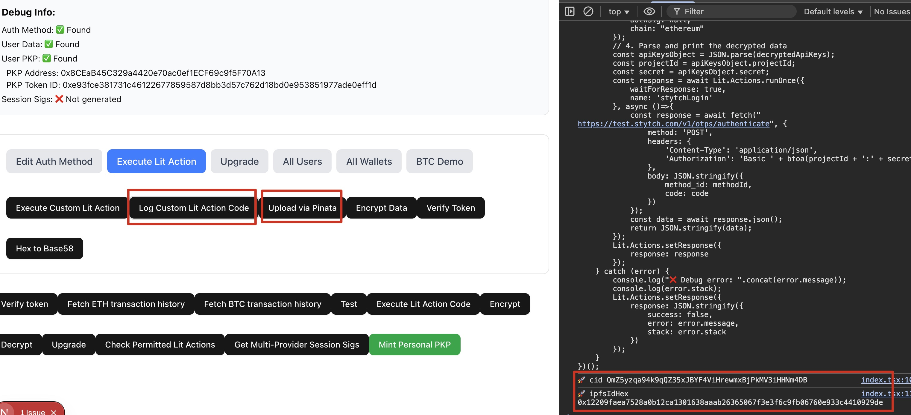

# Local Development Guide

## Requirements

- Node.js v22
- bun
- ngrok (for local Lit Action testing)

## Quick Start

### Start Development Server
```bash
bun install
npm run dev
or 
bun dev
```

## Lit Action Local Development

### Lit Action File Location

All Lit Action code is located in `/src/lib/lit-action-code/` directory:

### Local Debugging Lit Actions

#### 1. Install and Start ngrok
```bash
brew install ngrok
ngrok http 3000
```

ngrok provides a public URL for Lit Protocol nodes to access your local API.

When Lit Actions use fetch to call locally added API endpoints, they must access through ngrok's public URL because Lit Protocol nodes cannot directly access localhost.

#### 2. Update IPFS Configuration

Edit `/src/lib/lit/ipfs-id-env.ts` file to ensure Lit Action IPFS CIDs are correctly configured.

#### 3. Use Debug Page

Visit http://localhost:3000/debug



**Test Different Lit Actions**:
In `/src/app/debug/components/Example/ExecuteLitActionCode/index.tsx`, modify the `litActionCode` variable, for example:
```typescript
const litActionCode = litActionCodeForMultiProviderAuth
```

### Lit Action Code Update Process

When you modify Lit Action code, you need to update the corresponding IPFS ID configuration:

#### 1. Modify Lit Action Code
Modify the corresponding `.lit.ts` file in `/src/lib/lit-action-code/` directory

#### 2. Get New IPFS ID
1. Visit debug page http://localhost:3000/debug
2. Click **Execute Lit Action** button
3. Click **Log Custom Lit Action Code** button
4. You can see the generated new `cid` and `ipfsIdHex` at the bottom of the page

#### 3. Upload to Pinata
Click **Upload via Pinata** button to upload the new Lit Action code to IPFS network

#### 4. Verify IPFS Upload
You can check if the file was successfully uploaded through IPFS gateway:
```
https://ipfs.io/ipfs/QmT5Vi5byp1vcjE9gkxdWYz3zmScg3BBoM5wnWcUEqXiF7
```
Replace the CID with your actual IPFS ID.

#### 5. Update ipfs-id-env.ts Configuration
Update the corresponding IPFS ID in `/src/lib/lit/ipfs-id-env.ts` file:

```typescript
// Update base58 format ID
const yourLitActionIpfsId = 'QmZ5yzqa94k9qQZ35xJBYF4ViHrewmxBjPkMV3iHHNm4DB'

// Update hex format ID  
const yourLitActionIpfsIdHex = '0x12209faea7528a0b12ca1301638aaab26365067f3e3f6c9fb06760e933c4410929de'
```
